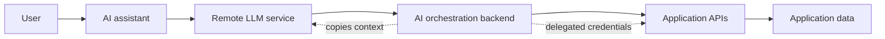
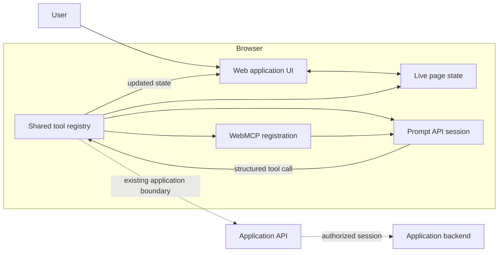
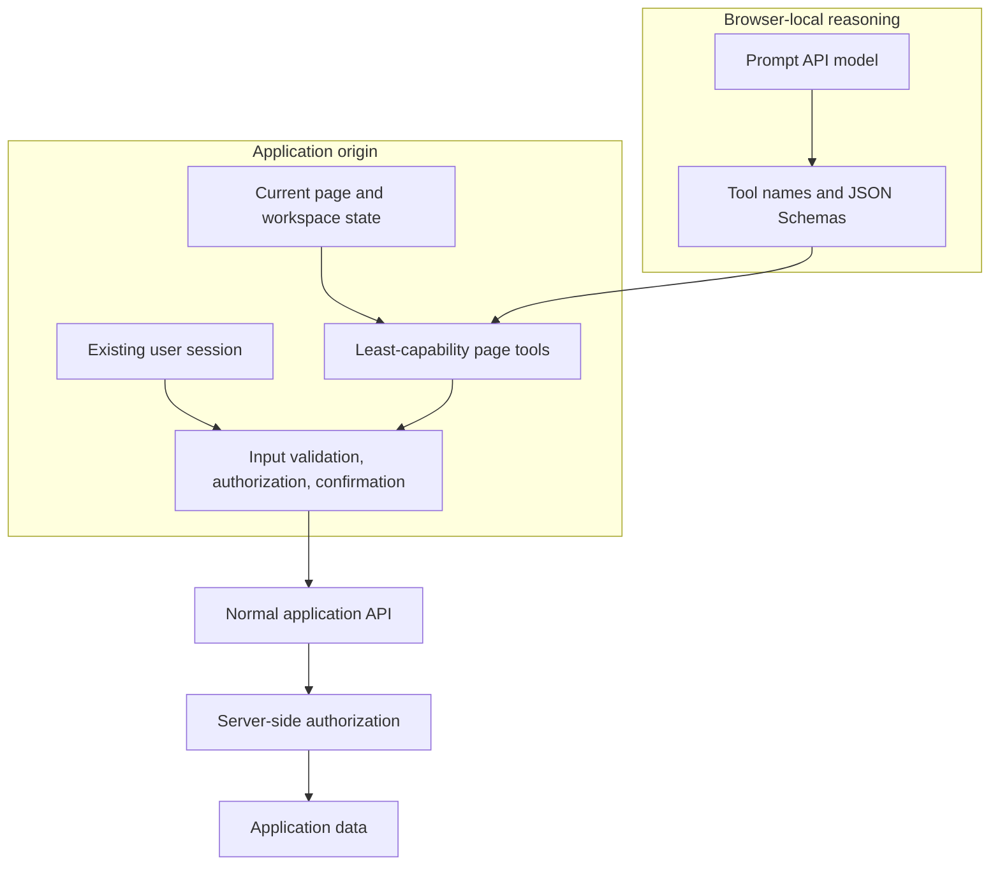
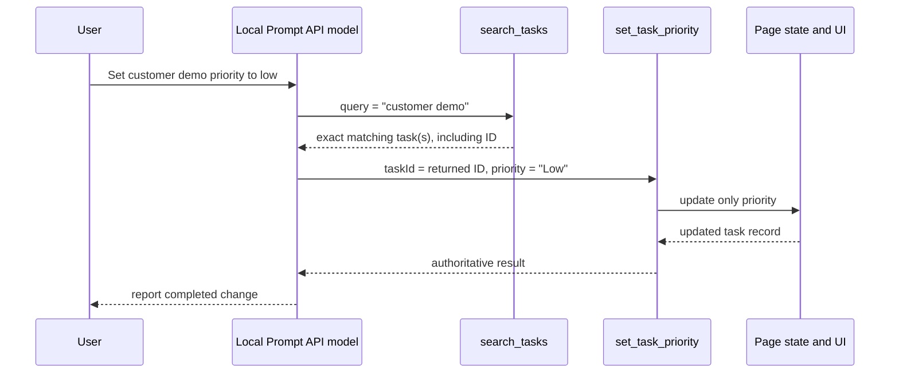

# The Website Is the MCP Server

## Why an on-device Prompt API becomes more interesting when it can use the page's own tools

The most interesting browser agent may not be the one that can operate every website from the outside. It may be the one that operates a single application from the inside, using the same state, session, and business rules that the application already trusts.

That is the experiment in this repository.

The project combines two emerging browser capabilities:

- **WebMCP**, which lets a page expose structured tools to an agent instead of making the agent infer intent from pixels and DOM controls.
- **The Prompt API**, which gives the page access to a browser-provided language model, currently backed by an on-device model in Chrome implementations.

Individually, each capability is useful. Together, they suggest a different architecture for web AI: the model supplies language understanding and planning, while the application remains the authority over data and side effects.

The page does not send workspace data to a separate LLM backend. It does not mint an AI-specific API token. It does not ask an external agent to reconstruct the user's session. The open page owns the workspace, the signed-in user, the tools, and the visible result. The local model is invited into that boundary.

That inversion is the point.

## The conventional agent boundary

Most application assistants introduce another system between the user and the application:



This design can work, but it creates additional responsibilities:

- The assistant backend must obtain and protect credentials.
- Application context must be copied, synchronized, or summarized for the model.
- Authorization has to be represented across another service boundary.
- The organization now has another place to audit prompts, tool calls, outputs, and sensitive data.
- The assistant may act through an API surface that is separate from the interface the user is looking at.

The problem is not that a remote model is always wrong. Larger models and server-side orchestration remain useful. The problem is that a generic assistant backend is often far away from the most accurate source of authority: the application that is already open and authenticated.

## A different arrangement: bring the model to the page

This project keeps the application boundary intact:



In the demo, the tool registry exposes five narrow capabilities:

```text
get_project_summary
search_tasks
get_current_user
set_task_status
set_task_priority
```

The same registry feeds both integration paths. WebMCP makes the tools visible to browser agents. The Prompt API session receives the registered tools for the page-local assistant. The implementation does not duplicate the task logic for each model surface.

That shared registry matters. It gives the application one place to define:

- what an operation is called;
- what arguments it accepts;
- whether it is read-only;
- what it returns;
- how it executes against current state;
- how the call appears in the audit log.

The model chooses among those capabilities. It does not become the database, permission system, or mutation implementation.

## Why on-device inference changes the calculation

WebMCP alone improves agent reliability by replacing visual guesswork with declared tools. The Prompt API alone gives a page a natural-language model without requiring every interaction to cross a server boundary. Their combination creates a useful division of labor:

| Responsibility | Best home |
|---|---|
| Understand the user's language | Local model |
| Choose a page capability | Local model, constrained by tool schemas |
| Know the current workspace state | Page tools |
| Enforce argument shape | Tool protocol |
| Enforce authorization | Application and server |
| Perform the mutation | Application code |
| Show the result | Existing UI |
| Record what happened | Page audit and trace |

This is a narrower problem than open-ended autonomous browsing. The model does not need to understand every element on the screen or maintain a complete copy of the workspace. It needs to map a request such as “find high priority tasks” or “set the customer demo task to low priority” onto a small, explicit capability set.

That makes on-device models more plausible for useful product workflows. A modest local model can be valuable when deterministic tools carry the facts and effects. The model handles ambiguity in human language; the application handles truth.

The Prompt API explainer identifies several potential benefits of browser-provided models, including local processing of sensitive data, offline use, lower API costs, and lower deployment overhead. Those benefits are not guarantees: browser support, model quality, device requirements, and implementation details still vary. They are reasons to test the architecture, not reasons to assume the architecture is solved.

## The authentication boundary is the real story

“The model runs locally” is a privacy property. It is not an authorization model.

The more important question is: **where does the agent get the authority to act?**

In a conventional remote-agent design, the application may need to issue a delegated token or expose a new backend endpoint for the assistant. In a page-native design, the tool implementation can run in the context of the already-open application. That page may already know:

- which user is signed in;
- which tenant or workspace is active;
- which feature flags apply;
- which records are visible;
- which anti-forgery protections are required;
- which normal application API should receive the operation.

The model does not need to receive the user's password or an AI-specific copy of the session. It asks the page to perform an operation through the page's own boundary.

The security boundary can be pictured like this:



WebMCP contributes origin isolation and explicit tool exposure. Its security guidance also calls out `readOnlyHint`, `consequentialHint`, and `untrustedContentHint` as signals that help an agent or browser reason about risk. Those hints improve the contract, but they do not replace authorization checks.

The production rule should be simple:

> Never let the model's belief about permission authorize an operation. Authorize the operation when the tool executes.

This repository makes the signed-in user and permissions visible through `get_current_user`, which is useful for demonstrating the boundary. The mock data layer is intentionally small, though, and its mutation functions are not a complete production authorization system. A real implementation would still validate the server-side session, tenant, object-level permission, mutation scope, anti-forgery requirements, replay behavior, and confirmation policy at execution time.

That limitation strengthens the experiment. It shows exactly where the browser-local model ends and application security must begin.

## Structured tools beat DOM interpretation

Without WebMCP, an agent may infer that a button labeled “Low” changes a task's priority, or that a row's visual state represents the current status. That is a fragile chain of observations.

With a structured tool, the page says what it means:

```json
{
  "name": "set_task_priority",
  "description": "Mutate only the priority field of one task, identified by an exact task ID returned by the advertised task lookup capability.",
  "inputSchema": {
    "type": "object",
    "properties": {
      "taskId": { "type": "string" },
      "priority": {
        "type": "string",
        "enum": ["High", "Medium", "Low"]
      }
    },
    "required": ["taskId", "priority"],
    "additionalProperties": false
  },
  "annotations": {
    "readOnlyHint": false
  }
}
```

The description is not decoration. It tells the model that this tool changes priority only, requires an exact identifier, and must not be used to discover a task. The schema prevents a free-form argument shape from quietly becoming part of the application contract.

The registry then validates every invocation before it reaches the implementation:

```ts
const invokeTool = (
  name: string,
  input: Record<string, string> = {},
  source = 'Page tool',
) => {
  const tool = tools.find((candidate) => candidate.details.name === name)
  if (!tool) return JSON.stringify({ error: `Unknown tool: ${name}` })

  const normalizedInput = normalizeToolInput(name, input)
  const validationError = validateToolInput(name, normalizedInput)

  if (validationError) {
    debugLog('error', `Rejected invalid ${name} arguments`, validationError)
    return JSON.stringify({
      error: validationError,
      retry: 'Follow the required tool chain and call search_tasks before changing a task.',
    })
  }

  // The tool executes only after protocol validation.
  return tool.run(normalizedInput)
}
```

This is an important design choice: safety does not live only in the system prompt. The prompt explains the workflow to the model, but the protocol and registry reject malformed or unsafe calls independently.

## The lookup-before-mutation rule

The most instructive workflow in the demo is a task update.

A user can say:

> Set the customer demo task priority to low.

The model must not guess an ID from the title. It must first search, inspect the returned record, and then use the exact returned ID in the mutation:



If the lookup returns zero matches, the agent asks for a clearer description. If it returns multiple matches, it asks the user to choose. It does not mutate a candidate while resolving ambiguity.

The application also distinguishes status from priority. A request to change priority cannot accidentally invoke the status tool, even though both operations update the same task record.

The agentic loop reinforces the same rule at runtime:

```ts
const requestedFields = getRequestedTaskMutationFields(message)
const requestedMutationField =
  requestedFields.size === 1 ? [...requestedFields][0] : undefined

if (!requestedMutationField && calledMutationField) {
  result = JSON.stringify({
    error: 'This is a read-only request. Do not call a mutation tool.',
    retry: 'Call search_tasks if task lookup is needed, then return a final response.',
  })
} else if (
  requestedMutationField &&
  calledMutationField &&
  requestedMutationField !== calledMutationField
) {
  result = JSON.stringify({
    error: `This request changes only ${requestedMutationField}.`,
    retry: `Use set_task_${requestedMutationField} with the exact taskId.`,
  })
} else {
  result = registry.invokeTool(toolCall.name, toolCall.input)
}
```

This is the difference between a demo that merely makes a model call functions and a demo that explores agent safety as an application design problem.

## The page becomes inspectable

The project deliberately exposes its own trace:

- WebMCP capability detection and registration;
- Prompt API availability and model download progress;
- session creation;
- every Prompt API request and response;
- tool name, source, arguments, result, timing, and status;
- rejected calls and retry paths.

That visibility is part of the product idea. A local agent should not be a black box simply because its model runs in the browser. The user can see which capability ran and can compare the result with the ordinary workspace UI.

The trace also answers questions that are easy to hide in a polished chat surface:

- Did the browser have the model, or did the application fall back?
- Were the tools registered with WebMCP?
- Did the model search before attempting a mutation?
- Which exact record changed?
- Did the operation return an error?
- Did a retry create a fresh session?

For enterprise software, those questions are not ancillary. They are part of the evidence needed to trust an agent with real work.

## What this experiment makes possible

The architecture is especially relevant where application context is sensitive, dynamic, or expensive to replicate:

### Enterprise workspaces

An internal project, CRM, support, or operations application can expose narrow tools over the data already visible to the signed-in employee. A local assistant can help users search and operate on that workspace without sending every conversation and result to a separate model service.

### Offline-first applications

After the browser has the local model and the application has local state, some workflows can continue without a model round trip. This does not make every application offline-capable, but it makes local assistance a possibility rather than an automatic dependency on network access.

### Encrypted or privacy-sensitive applications

Applications that deliberately minimize server visibility may be poor candidates for a cloud assistant. A browser-local model can analyze data after the application has decrypted it for the user, while page tools keep the operations inside the existing interface.

### Browser-based development tools

An IDE or diagnostic console can expose structured commands such as “show failing tests,” “explain this error,” or “rerun the selected check.” The page has the current project context; the model translates language into a constrained command.

### Complex forms and support flows

WebMCP's structured inputs can help an agent fill or navigate complex flows without treating the DOM as an undocumented API. The page can expose a capability for the meaningful action rather than requiring the agent to operate every intermediate control.

These are hypotheses to validate, not promises. The useful question is not whether every website should expose every action to an agent. It is whether selected applications can publish carefully scoped capabilities that make assistance safer and more reliable.

## What the experiment does not prove

The repository is a focused browser demonstration, not a complete production security architecture.

It does not prove:

- that a local model is available on every browser or device;
- that on-device inference is guaranteed by the Prompt API abstraction;
- that a small model will reliably resolve every natural-language request;
- that prompt injection is solved;
- that a tool description can replace server-side authorization;
- that every mutation should be automated without confirmation;
- that a browser-local trace is a complete compliance audit;
- that the same behavior will be identical across model versions and browsers.

WebMCP's own security guidance emphasizes that language models remain susceptible to indirect prompt injection. Tool descriptions, schemas, origin restrictions, risk hints, confirmation, and deterministic application checks reduce the attack surface, but no single layer removes the problem.

The honest conclusion is narrower and more useful: **structured, page-native tools give an on-device model a better place to operate than an unstructured screen, and the existing application boundary gives those operations a natural authority context.**

## A practical implementation pattern

For an application team evaluating this direction, the repository suggests a sequence:

1. Identify a small set of read-only capabilities whose results are already visible in the page.
2. Give each capability a precise name, description, JSON Schema, and output shape.
3. Mark read-only and consequential behavior explicitly.
4. Route all execution through one registry and one application boundary.
5. Require lookup and exact identifiers before mutations.
6. Validate inputs again outside the model prompt.
7. Authorize each operation at execution time.
8. Make tool calls, errors, and returned records visible to the user.
9. Test the same workflow with the local model unavailable, the model returning malformed JSON, ambiguous search results, and tool failures.
10. Add confirmation before consequential or irreversible actions.

The code should make the safe path the easy path. If a mutation requires a lookup, the tool contract should say so, the registry should validate its arguments, and the agent loop should reject a shortcut.

## The larger idea

WebMCP and the Prompt API are often described as separate browser AI features: one exposes tools, the other exposes a model. The more interesting reading is architectural.

The model is probabilistic and good at interpreting intent. The application is deterministic and good at maintaining state, enforcing rules, and performing effects. The browser is the place where those two systems can meet without automatically creating a new backend authority.

That does not eliminate the need for servers, authentication, or authorization. It gives them a better division of labor:

- the server remains the authority over durable data and permissions;
- the page carries the user's live context;
- WebMCP declares what the page can do;
- the Prompt API helps the user express what they want;
- the application decides what is actually allowed.

The future of web agents may not be a choice between “chatbot” and “browser automation.” It may be a web where applications publish semantic, inspectable capabilities and local models use them under the same boundaries that already protect the user.

The important shift is not that the model moved into the browser. It is that the application can finally explain, from the inside, what an agent is allowed to do.

## References

- [WebMCP | Chrome for Developers](https://developer.chrome.com/docs/ai/webmcp)
- [WebMCP tool security | Chrome for Developers](https://developer.chrome.com/docs/ai/webmcp/secure-tools)
- [Prompt API | Chrome for Developers](https://developer.chrome.com/docs/ai/prompt-api)
- [Prompt API explainer | Web Machine Learning Community Group](https://github.com/webmachinelearning/prompt-api)
- Repository implementation: [`src/webmcp-service.ts`](../src/webmcp-service.ts), [`src/prompt-api-service.ts`](../src/prompt-api-service.ts), [`src/tool-registry.ts`](../src/tool-registry.ts), [`src/tool-protocol.ts`](../src/tool-protocol.ts), [`src/data/tools.json`](../src/data/tools.json)
